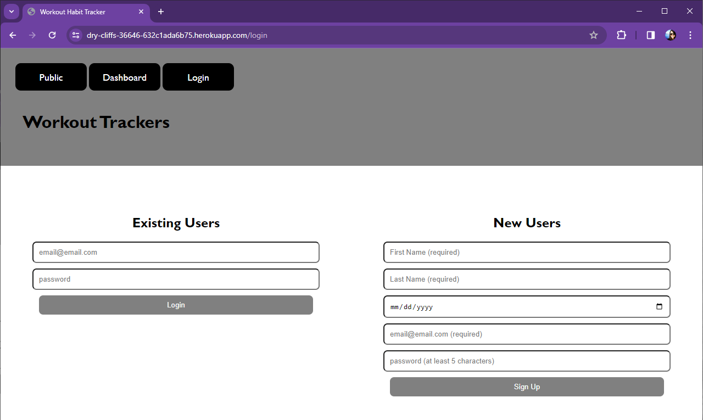
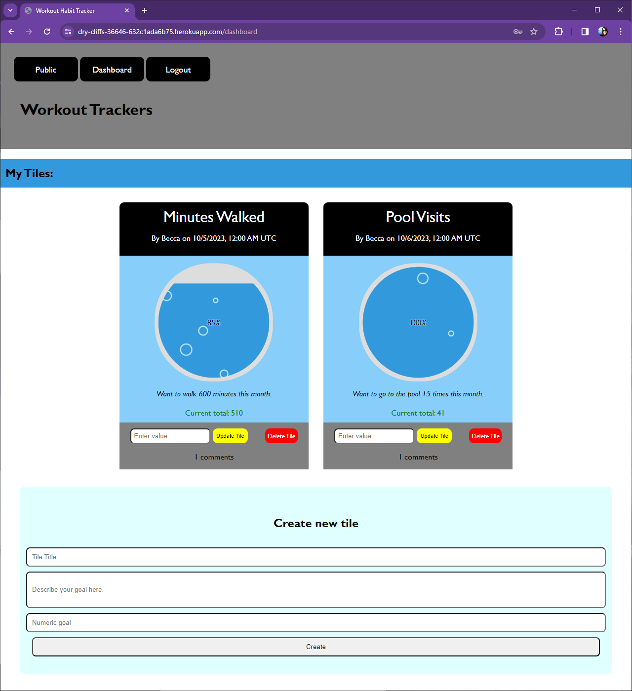
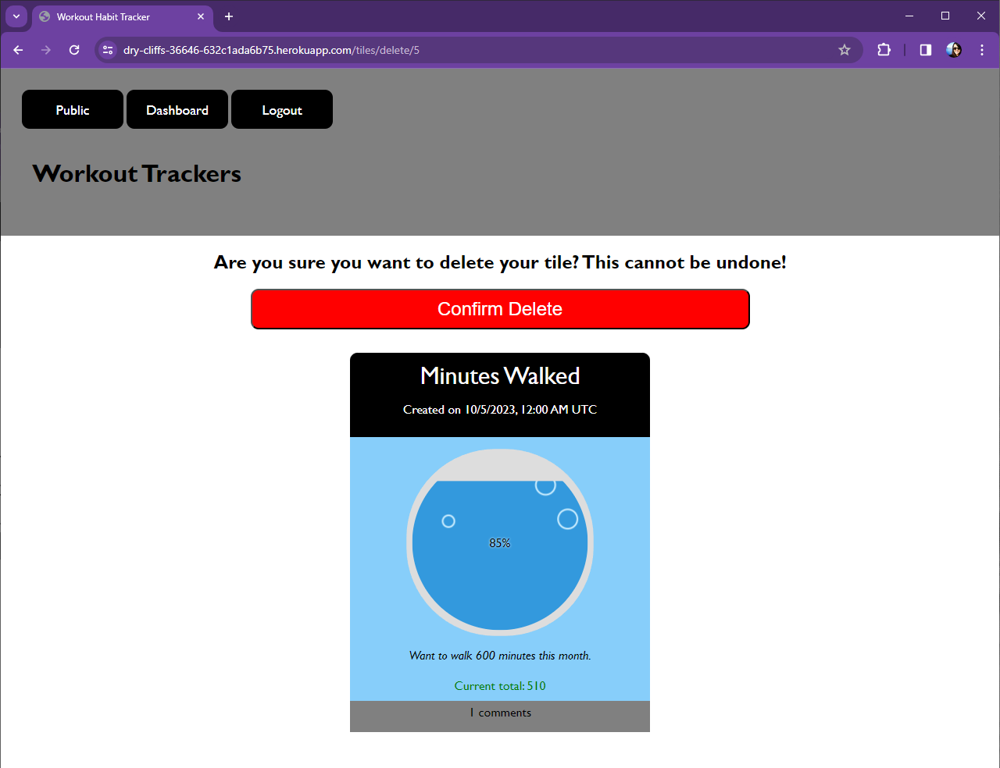
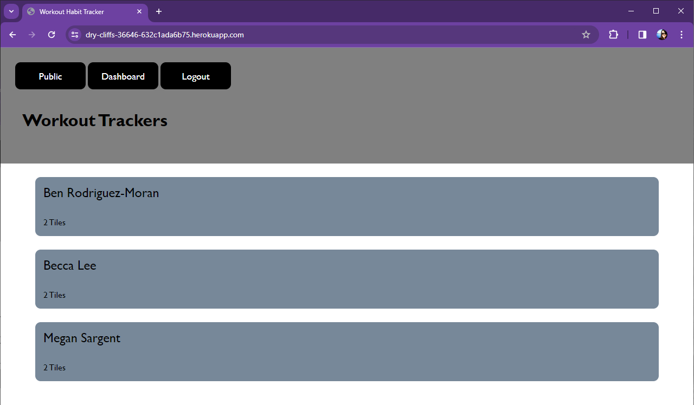
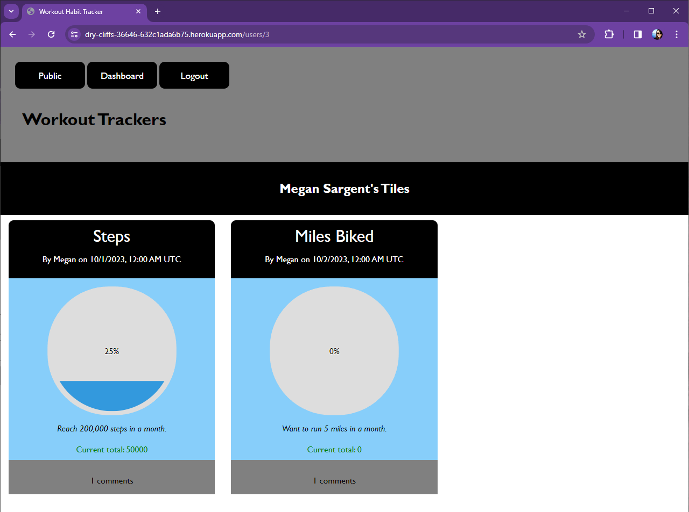
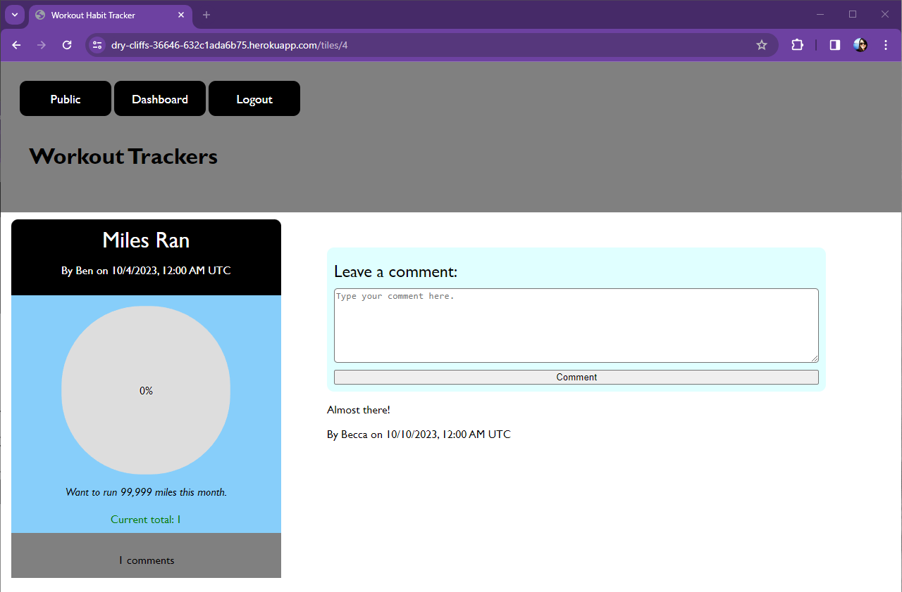
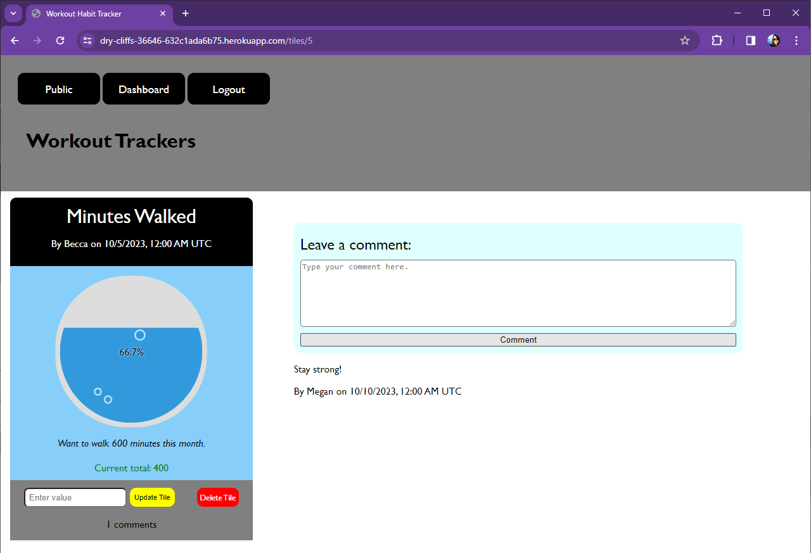

# Workout-Habit-Tracker
 

## Description
There are several fitness apps that track a myriad of very detailed statistics. Sometimes, these don’t match a user's needs whether they are too complex or missing specific features. 

This is an application where users can create their own goals and keep track of their completion through a percentage.

On this site, users will be able to view other's habit trackers and leave comments for accountability and/or encouragement.

## Table of Contents
- [Description](#description)
- [Table of Contents](#table-of-contents)
- [Deployed Application](#deployed-application)
- [Usage](#usage)
  - [Login and Signup](#login-and-signup)
  - [Dashboard](#dashboard)
  - [Deleting a Tile](#deleting-a-tile)
  - [Public and Viewing Other Users](#public-and-viewing-other-users)
  - [Commenting on Tiles](#commenting-on-tiles)
- [Technologies Used](#technologies-used)
- [Future Development](#future-development)
  - [Phase 1: Additional User-Error Handling and Editing Functionality](#phase-1-additional-user-error-handling-and-editing-functionality)
  - [Phase 2: User Privacy and Relations](#phase-2-user-privacy-and-relations)
  - [Phase 3: Completed Tiles](#phase-3-completed-tiles)
  - [Phase 4: Public Page Upgrade](#phase-4-public-page-upgrade)
  - [Phase 5: Overall Tile Complexity and Tracker Customization](#phase-5-overall-tile-complexity-and-tracker-customization)
  - [Phase 6: Third-Party Application](#phase-6-third-party-application)
- [Resources](#resources)
- [Questions](#questions)

## Deployed Application
[Workout Habit Tracker](https://dry-cliffs-36646-632c1ada6b75.herokuapp.com/)

## Usage
To use this site, users must sign up and be logged in. 
They must be logged in to create tiles, view other users' tiles, and view/add comments.

### Login and Signup
- When navigating to the site, users will have a choice to login or sign up.  

### Dashboard
- Once logged in, users will be directed to their dashboard where they can view all of their tiles, update or delete them, and create a new tile.  
- Also, the login button will be replaced by a logout button in the navigation bar.    

### Deleting a Tile
- When a user tries to delete their tile, they are taken to a second page to confirm deletion.  
- In case the user does not want to delete their tile, they can navigate away from this page.  
- When the user deletes the tile, they are directed back to their dashboard.  

### Public and Viewing Other Users
- On the public page, all users are listed. 
- Clicking on a user's name will direct the user to view that user's tiles.  
  

### Commenting on Tiles
- The user can click on the title of the tile, which will direct them to a view of that single tile.  
- Here, they can leave comments and view all other comments on this tile. 
- If it is a user's own tile, the update and delete buttons will still be visible, but otherwise there will be no update/delete tile buttons available. 

## Technologies Used
This Node Express application uses the following packages:
   - [bcrypt v.5.1.1](https://www.npmjs.com/package/bcrypt/v/5.1.1)
   - [colors v.1.4.0](https://www.npmjs.com/package/colors/v/1.4.0)
   - [connect-session-sequelize v.7.1.7](https://www.npmjs.com/package/connect-session-sequelize/v/7.1.7)
   - [dotenv v.16.3.1](https://www.npmjs.com/package/dotenv/v/16.3.1)
   - [express v.4.18.2](https://www.npmjs.com/package/express/v/4.18.2)
   - [express-handlebars v.7.1.2](https://www.npmjs.com/package/express-handlebars/v/7.1.2)
   - [express-session v.1.17.3](https://www.npmjs.com/package/express-session/v/1.17.3)
   - [mysql2 v.3.6.3](https://www.npmjs.com/package/mysql2/v/3.6.3)
   - [sequelize v.6.35.0](https://www.npmjs.com/package/sequelize/v/6.35.0)
   - [LoadingBar.js](https://loading.io/progress/)

- The colors package was used to modify console.logs for development.
- The application uses dotenv to for environment variable management.
- The Sequelize package is used to store the database.
- The bcrypt package handles hashing passwords stored in the User model.
- The application utilizes connect-session-sequelize and express-sessions to store sessions to the database.
- Express-handlebars is the view engine for rendering handlebars templates.
- On the client-side, the application utilizes Loading Bar, a Flexible JavaScript Progress Bar Library.

## Future Development  
There are several possibilities for future development.  The following highlights some of the anticipated future developments: 

### Phase 1: Additional User-Error Handling and Editing Functionality
Enhancements in this phase include:

- **Comment Management:** Users can delete or edit comments they've authored or delete those associated with a tile they created.
- **Tile Editing:** Users can modify any aspect of their tile, such as the description, title, or deducting from the current total.

### Phase 2: User Privacy and Relations 

- **Private Tiles:** Users can set their tiles to private to restrict visibility, either completely or to other designated users. 
- **User Relationships:** Development to create relationships between users, not unlike features available on many social media sites.

### Phase 3: Completed Tiles
- **Display Achievements:** Development for a page where users can display their completed tiles.

### Phase 4: Public Page Upgrade
- **Thumbnail Display:** The public view displays only user's name and the quantity of tiles authored. Development needed to display a small view of the trackers.
- **User Profile Pictures:** User profiles on the public page ideally incorporate view profile pictures, which should also be incorporated throughout other pages in the application.

## Phase 5: Overall Tile Complexity and Tracker Customization
- **Multiple Trackers:** Each tile is associated with only one tracker. Development can allow for users to associate multiple trackers with a single tile, allowing them to set more complex goals. 
- **Shared Tiles:** Each tile is associated with a single user. Development is needed for introducing shared tiles to enabling collaborative or competitive efforts .
 **Tracker Customization:** The tracker itself appears the same throughout the application. LoadingBar.js offers robust customizable options.  Development is needed for the application to incorporate more of the features of LoadingBar.js or an alternative package to give users the ability to personalize the appearance and features of the tracker.

## Phase 6, Third-Party Application
- **Fitness Data Integration:** Development is needed to integrate this application with external fitness tracking applications, allowing users the option for automatic tracker updates.

## Resources
- [MDN Web Docs](developer.mozilla.org)  
- [W3Schools](www.w3schools.com/)  
- [stack overflow](stackoverflow.com/)  
- [Sequelize v6 Documentation](https://sequelize.org/docs/v6/)  
- [Blog Post about using { plain:true } to serialize Sequelize data](https://www.michaellapan.com/posts/sequelize-plain-true)  
- [Flexbox CSS Guide](https://css-tricks.com/snippets/css/a-guide-to-flexbox/)  

## Questions
- Github: [hjlee17](https://github.com/hjlee17)
  